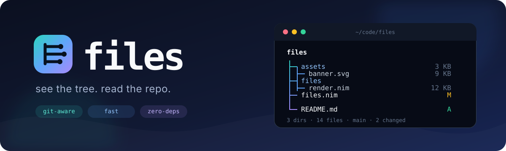

<div align="center">
  

  <p>
    <strong>A fast, git-aware directory tree for your terminal.</strong><br>
    The familiar shape of <code>tree</code>, with repository context built in.
  </p>

  <p>
    
    
    
  </p>
</div>

`files` respects `.gitignore`, annotates working-tree changes, and renders a
compact depth-gradient with Nerd Font icons and right-aligned file sizes. It is
written in Nim and has no runtime dependencies beyond `git` for status badges.

## Highlights

- **Gitignore-aware by default.** Native matching supports negation, anchored
  paths, directory rules, `**`, wildcards, and nested `.gitignore` files.
- **Repository context at a glance.** A single porcelain-status query adds
  staged, modified, untracked, and conflict badges; the footer shows the branch.
- **Made for terminal scanning.** Depth colors, natural sorting, type-specific
  icons, aligned sizes, and terminal-width truncation keep large trees readable.
- **Safe around symlinks.** Linked directories are displayed, never traversed.
- **Useful without Git.** Point it at any directory or pass `--no-git` for a
  standalone tree viewer.

## Quick start

Requires [Nim 2.0+](https://nim-lang.org/install.html). `git` is optional and
only used to display repository status.

```sh
git clone https://github.com/HelgeSverre/files.git
cd files
make install       # builds and copies files to ~/.local/bin

files              # inspect the current directory
files -L 2 ~/code  # show two levels under ~/code
files -a            # reveal hidden and ignored entries
```

`make install` expects `~/.local/bin` to be on your `PATH`. To build without
installing, run `make build` and use `./bin/files`.

## Usage

```text
files [options] [path]
```

| Flag | Meaning |
| --- | --- |
| `-a`, `--all` | Show hidden and gitignored entries, rendered as ghosts |
| `-L`, `--depth <n>` | Limit recursion depth |
| `-I`, `--ignore <glob>` | Add an ignore pattern; may be repeated |
| `-t`, `--sizes` | Show file sizes (default) |
| `--no-sizes` | Hide file sizes |
| `--no-icons` | Disable Nerd Font icons |
| `--no-color` | Disable ANSI colors |
| `--no-git` | Skip Git repository and status lookups |
| `--no-defaults` | Include built-in junk directories such as `node_modules` |
| `-h`, `--help` | Show help |
| `-v`, `--version` | Print the version |

## How it works

```text
files.nim            CLI entry point
files/ignore.nim     gitignore parser and matcher
files/gitstatus.nim  repository discovery and porcelain parsing
files/walk.nim       tree collection, filtering, and cycle protection
files/render.nim     gradient, icons, layout, and aligned sizes
files/util.nim       natural sorting, human sizes, and ANSI helpers
tests/               matcher tests
```

On macOS, directory enumeration uses `getattrlistbulk`; other platforms fall
back to Nim's portable directory walker.

## Development

```sh
make test   # compile and run the matcher suite
make build  # create an optimized binary at bin/files
make run    # build and inspect this repository
```
